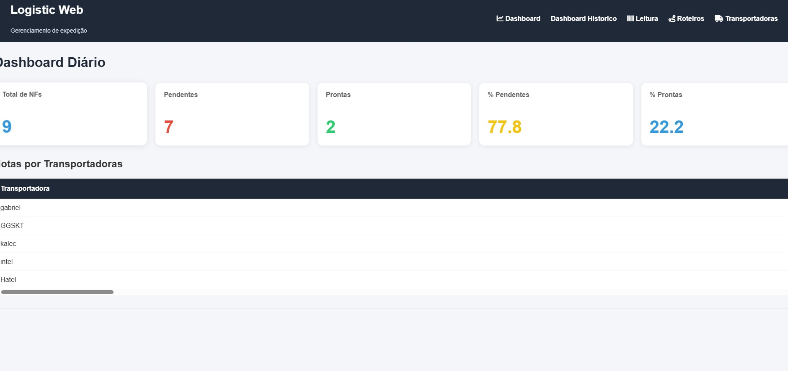
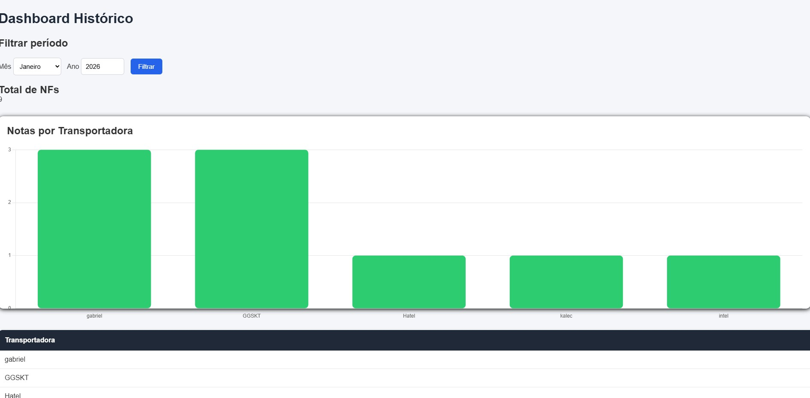
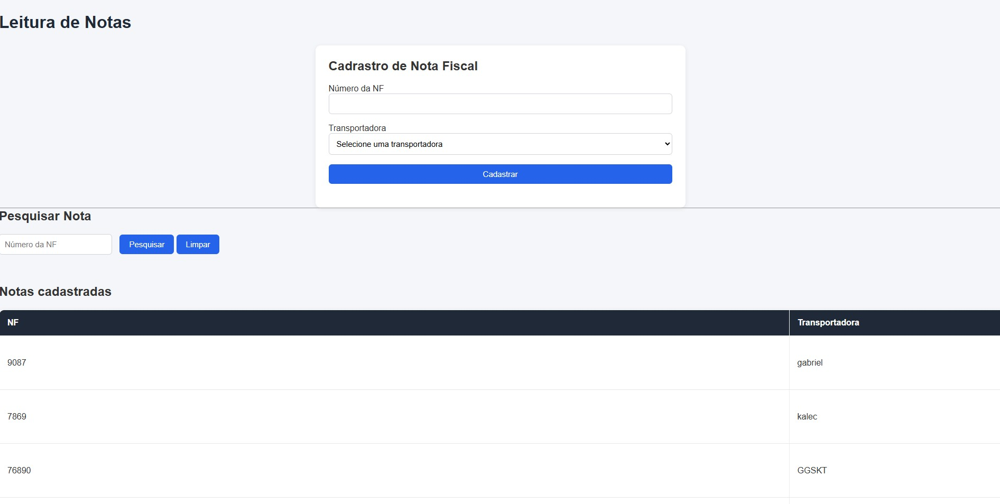
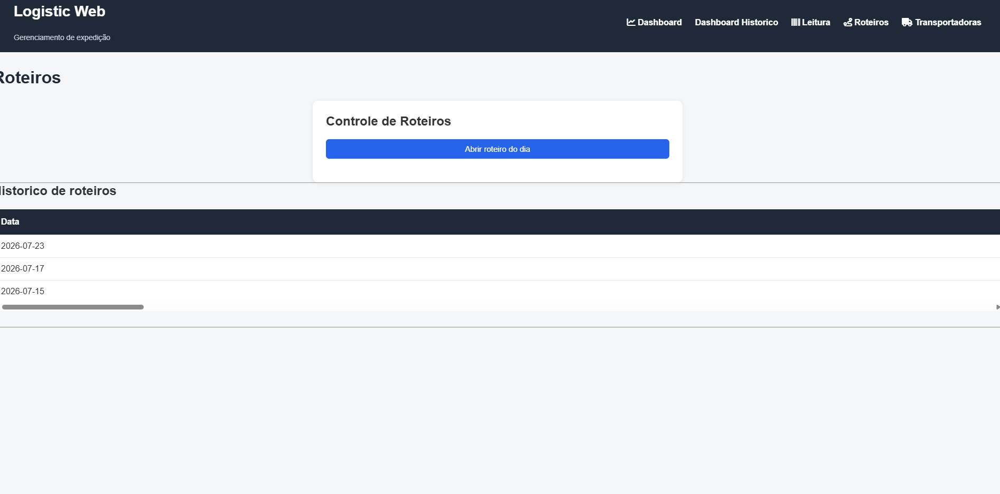
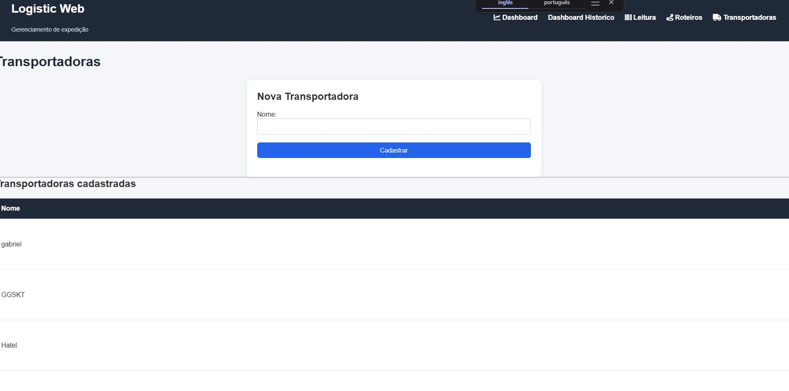

  Logistic Web V2

Sistema web para gerenciamento de expedição de Notas Fiscais desenvolvido com Flask e SQLite.

Sobre o projeto

O Logistic Web foi desenvolvido para facilitar o controle da expedição de Notas Fiscais em operações logísticas.

O sistema permite cadastrar transportadoras, registrar Notas Fiscais, organizar roteiros diários e acompanhar indicadores por meio de dashboards com gráficos.

Este projeto foi desenvolvido como estudo prático para aprofundar conhecimentos em desenvolvimento web com Python e Flask.

  Tecnologias utilizadas

Python
Flask
SQLite
HTML5
CSS3
JavaScript
Chart.js
Git e GitHub

  Funcionalidades

  Transportadoras

Cadastro de transportadoras
Edição de transportadoras
Pesquisa por nome
Ordenação alfabética
Notas Fiscais
Cadastro de NFs
Associação automática ao roteiro aberto
Pesquisa por número da NF
Alteração de status
Registro da hora de conclusão

  Roteiros
  
Abertura de roteiro diário
Fechamento de roteiro
Histórico de roteiros
Visualização das NFs de cada roteiro

  Dashboard Diário
  
Total de NFs
NFs Pendentes
NFs Prontas
Percentual de Pendentes
Percentual de Prontas

  Dashboard Histórico
  
Consulta por mês e ano
Total de NFs expedidas
Quantidade por transportadora
Total de roteiros
Média de NFs por roteiro
Gráfico de barras utilizando Chart.js

  Recursos implementados

Interface responsiva
Validação de formulários
Tratamento de exceções
Mensagens de sucesso e erro
Organização em camadas
Banco de dados relacional

  Estrutura do projeto
  LogisticWebV2/
  
│
├── app.py
├── database.py
├── database.db
├── requirements.txt
│
├── static/
│   ├── css/
│   └── imagens/
│
├── templates/
│   ├── base.html
│   ├── dashboard.html
│   ├── dashboard_historico.html
│   ├── leitura.html
│   ├── roteiros.html
│   └── transportadoras.html
│
└── README.md

Como executar o projeto

Clone o repositório:

git clone <https://github.com/gabrielxavii/Gerenciador-de-notas>

Entre na pasta do projeto:

cd LogisticWebV2

Instale as dependências:

pip install -r requirements.txt

Execute a aplicação:

python app.py

Depois acesse:

http://127.0.0.1:5000

  Melhorias futuras

Compatibilidade com leitores de código de barras (scanner USB)
Controle de usuários e autenticação
Relatórios em PDF
Exportação para Excel
Deploy em ambiente de produção

## Dashboard Diário

## Dashboard Histórico

## Leitura

## Roteiros

## Transportadoras

